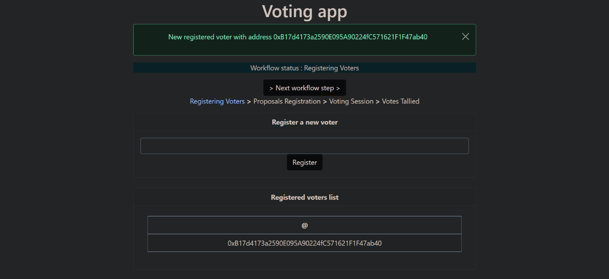
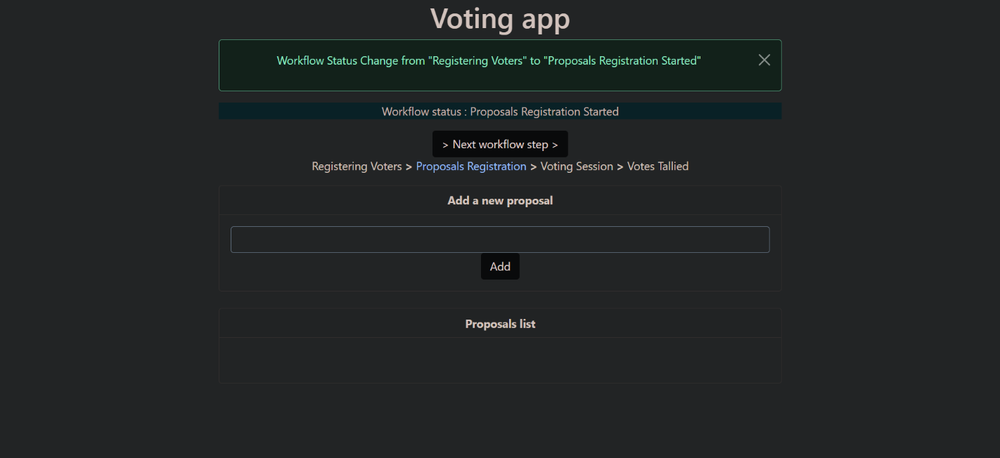
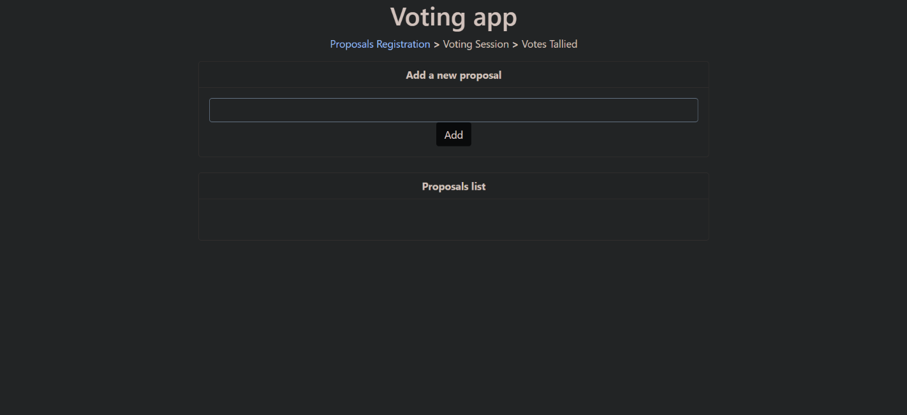

# ⚡️ DAO Voting System challenge

A voting smart contract can be simple or complex, depending on the requirements of the elections you want to support. The vote may be on a small number of pre-selected proposals (or candidates), or on a potentially large number of proposals suggested dynamically by the voters themselves.
In this framework, you will write a voting smart contract for a small organization. Voters, all known to the organization, are whitelisted by their Ethereum address, can submit new proposals during a proposal registration session, and can vote on proposals during the voting session.
✔️ Voting is not secret
✔️ Each voter can see the votes of others
✔️ The winner is determined by simple majority
✔️ The proposal that gets the most votes wins.

## 👉 The voting process:
Here's how the entire voting process unfolds:
• The voting administrator registers a whitelist of voters identified by their Ethereum address.
• The voting administrator starts the recording session of the proposal.
• Registered voters are allowed to register their proposals while the registration session is active.
• The voting administrator terminates the proposal recording session.
• The voting administrator starts the voting session.
• Registered voters vote for their preferred proposals.
• The voting administrator terminates the voting session.
• The voting administrator counts the votes.
• Everyone can check the final details of the winning proposal.
 
## 👉 Recommendations and requirements:
• Your smart contract must be called “Voting”.
• Your smart contract must use the latest version of the compiler.
• The administrator is the one who will deploy the smart contract.
• Your smart contract must define the following data structures:
```
structVoter {
  boolisRegistered;
  boolhasVoted;
  uint votedProposalId;
}
```
```
structProposal {
  stringdescription;
  uint voteCount;
}
```
• Your smart contract must define an enumeration that manages the different states of a vote
```
enumWorkflowStatus {
  RegisteringVoters,
  ProposalsRegistrationStarted,
  ProposalsRegistrationEnded,
  VotingSessionStarted,
  VotingSessionEnded,
  VotesTallied
}
```
• Your smart contract must define a winningProposalId uint that represents the winner's id or a getWinner function that returns the winner.
• Your smart contract must import the smart contract from OpenZepplin's “Ownable” library.
• Your smart contract must define the following events:
event VoterRegistered(address voterAddress);
event WorkflowStatusChange(WorkflowStatus previousStatus, WorkflowStatus newStatus);
event ProposalRegistered(uint proposalId);
event Voted (address vote, uint proposalId);

## Github Pages on ropsten testnet
https://steftroubadour.github.io/Voting-App/

## admin view





## user view


